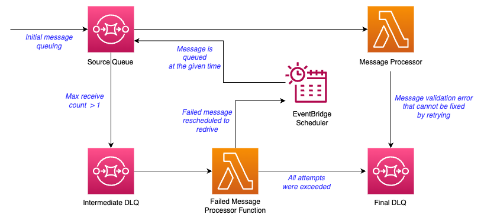

# Controlled retries with SQS using AWS Scheduler

This project contains the source code of the app that illustrated in the above diagram.

This can be set up in your own AWS environment with AWS CDK and Python.

For explanation and set up instructions, please refer to this blog post:
[Blog URL]